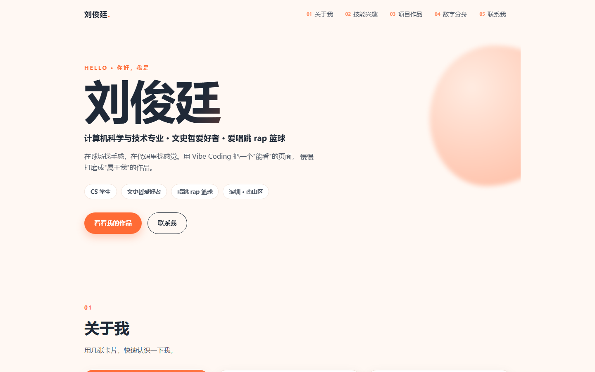
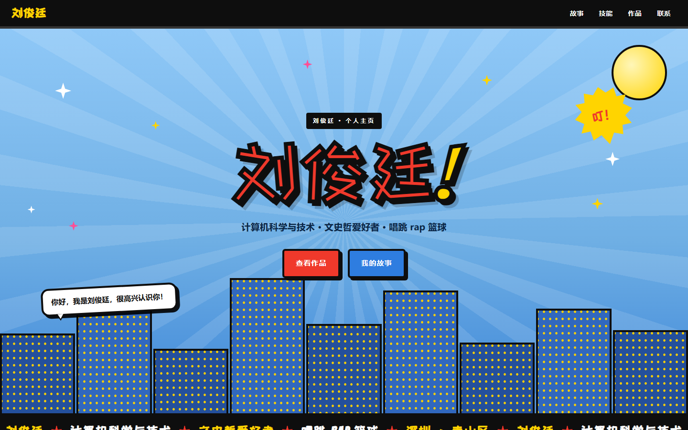
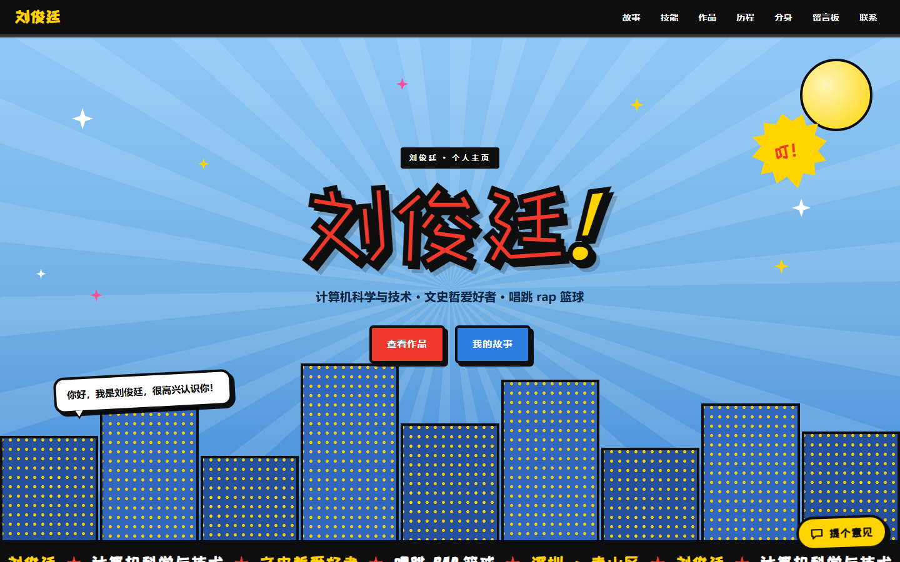
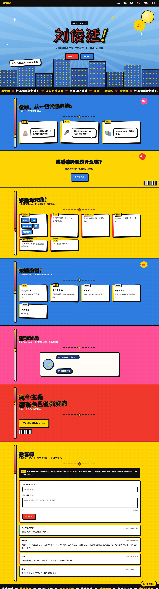
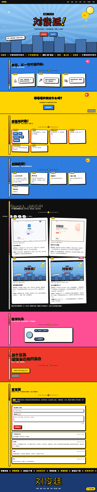

# 个人主页 V1 → V4 · 迭代记录与总结报告

**刘俊廷** · 计算机科学与技术
在线地址：<https://handsome-liujunting.github.io/Project-based-curriculum/>
代码仓库：<https://github.com/handsome-liujunting/Project-based-curriculum>
单文件离线版：`outputs/personal-homepage-v35-standalone/index.html`（双击即可打开，无需联网）
报告日期：2026-10-06 ｜ V4 提交：`7a76419` + 补丁 `6f501cb` ｜ **上线状态：已推送到 `main`（线上 HEAD `3f48cd9`），打开同一链接就是本文实测的 V4**

---

## 0. 一句话概览

一个**纯静态**的个人主页：手写 HTML/CSS/JS，**零框架、零构建、零第三方脚本**。四个版本的改动全部留在同一个仓库里，每一版都有截图、有理由、有验证。

| 项目 | V4 现状 |
| --- | --- |
| 页面结构 | 8 个 `section`、43 个 `id`、18 个 `article` 卡片 |
| 样式 / 脚本 | 5 个 CSS、5 个 JS（全部本地文件，无 CDN） |
| 字体 | 自托管 2 个开源子集（站酷快乐体 44952 B / 432 汉字；Bangers 11072 B / 64 字符） |
| 图片 | 4 张版本缩略图（合计约 236 KB），全站仅此 4 张位图 |
| 单文件离线版 | 515760 B，4/4 图片内联为 data URI，断网无断图 |
| 结构校验 | `verify_v35.ps1 -SiteOnly` → FAIL count = 0（10 组结构/契约/安全检查） |

---

## a) 开发历史（版本 + 截图）

| 版本 | 日期 | 提交 | 一句话 | 主要改动 |
| --- | --- | --- | --- | --- |
| V1 | 2026-09-05 | `f7aa66e` | 先让它能打开 | 语义化 HTML + 响应式 CSS，蓝色主色，卡片说明"我是谁、我会什么、怎么找我" |
| V2 | 2026-09-10 | `4062811` | 换成卡片化排版 | 卡片化布局 + 暖橙配色，导航加编号，首屏写正经自我介绍，标签换成"文史哲爱好者" |
| V3 | 2026-09-12 | `dcdb257` | 整站重画成美漫风 | 粗描边、网点、对话气泡、放射背景、楼群剪影、跑马灯；自托管两款开源字体 |
| V3.5 | 2026-09-21 | `6bb6ec2` | 不动设计，先加通道 | 只加反馈入口与公开留言板（接真后台），方便与 V3 逐项对照 |
| **V4** | **2026-10-06** | **`7a76419`** | **加上收意见的入口** | 迭代历程区块 + 版本号推到 V4 + 反馈可用性修复 + 作品区口径修正 + 历程区块版本目录 |

四个版本的首屏放在一起看：

<div class="row">


</div>

<div class="row">


</div>

**这次改版的 Before / After（同一口径拍摄：1440×900 视口 + 首屏冻结，可逐块对照）：**

<div class="row">


</div>

左：V3.5（2026-09-21）｜右：V4（2026-10-06）。新增的是**深色的"历程"区块**（放 V1–V4 的首屏与理由）、右下角的**"提个意见"悬浮按钮**，以及导航里的"历程"入口；其余区块结构基本沿用。历程区块顶部还加了一排 **V1→V4 的版本目录**（4 个胶囊，点一下直接跳到对应卡片）。

**为什么每一版要这么改：**

1. **V1**：先把"打得开、看得懂"做出来。版本号、动效、字体、后台一开始都不碰 —— 免得还没成型就陷进细节。
2. **V2**：第一版"像套模板"。于是改卡片化布局、加暖色、导航加编号，首屏写一句正经的自我介绍；顺手把"三分王"这类当时的标签换成更贴我的"文史哲爱好者"。
3. **V3**：前两版"好看，但不像我"。整站重画成美漫/波普风：粗描边、半调网点、对话气泡、放射背景、楼群剪影、跑马灯，并自托管两款开源字体（不依赖外部字体服务）。
4. **V3.5**：想加"收集意见"的能力，但**不改设计**，先只加通道（反馈入口 + 留言板），这样能和 V3 逐项对照着验收。
5. **V4**：把"过程"本身放到页面上（迭代历程区块），让访客自己能看见四版怎么变；同时修掉几处"能用但不体面"的问题（版本号、错误文案、作品区口径）。

## b) 新增 / 修改的主要功能（附想法来源）

| # | 功能 | 出现在 | 想法来源 | 解决了什么 |
| --- | --- | --- | --- | --- |
| 1 | **迭代历程区块**（V1–V4 首屏 + 改了什么/为什么 + 提交号） | V4 | 课件 V4"好迭代 = 更好的决定，而不是更多改动"；作业要求报告能证明过程 | 把"我改过什么、为什么改"从口述变成访客能自己看的东西 |
| 2 | **反馈入口「提个意见」**（私密，只有我能看到） | V3.5 | 课件 V4 闭环第一步 Collect + "收集真实反馈"的要求 | 有一个真能收到意见的通道，而不是等别人主动说 |
| 3 | **公开留言板** | V3.5 | 个人主页需要"有人来过"的信号；课件 V3 的"静态托管 + 后台"练习 | 访客能匿名留一句话，墙上只读、公开 |
| 4 | 反馈自动附带**网站版本号** | V3.5 / V4 修正 | 自测：表单里的版本号还停在 V3.5，收到的意见会贴错版本 | 每条意见都自带来源版本，版本号只留一个来源 |
| 5 | 错误提示**中文化**（`friendly(err)`） | V4 | 自测：后台不可达时访客看到英文 `Failed to fetch` | 访客看到的是"网络好像不通，不影响别的"，原始信息只留给 console |
| 6 | **作品区口径修正** | V4 | 自测：作品区把"同一个项目"当两个作品，且文案停在 V2 | 作品列表与迭代历程不再互相打脸；数字分身如实标注为"本地关键词匹配、不联大模型" |
| 7 | **字体子集重建** | V4 | 自测：新文案里出现缺字（方框） | 432 个汉字全在子集内，仍不依赖外部字体服务 |
| 8 | **单文件离线版** | V3.5 / V4 重导 | 交付与演示需要"离线也能开、也能发" | 515760 B 单文件，4/4 图片内联，断网无断图 |
| 9 | **历程区块的版本目录**（V1→V4 胶囊，点一下直达） | V4 修订 | 自测：四张卡排成两列两行，滚到这一节时第一屏只完整显示 V1、V2，容易被读成「只做了两版」 | 「一共四版」直接摆在区块最上面，一眼可见、一点即达 |

**刻意没做的（写了理由，见 `docs\V4-反馈决策表.md`）：**

- **不换 `supabase-js`**：前端只做"写一条、读一列"，原生 `fetch` 足够；引入 SDK 只为省几行代码，不值得多一个依赖。
- **迭代缩略图暂不加懒加载**：收益有限，却要同时改导出（内联）、同步、截图三条链路 —— 记为下次加图时的第一步。
- **留言板不加登录门槛**：匿名墙的意图就是"随便留一句"，加登录会劝退。

## c) 遇到并解决的问题（原因 + 解决）

> 这一节按"现象 → 排查 → 根因 → 解决 → 验证"写，包括我自己踩的坑和工具骗我的那两次。

**C1. 手机端"导航和标题被裁掉了"（假缺陷）**
- 现象：375 宽的头屏截图中，导航最后两项和标题右侧像被切掉。
- 排查：先用页内几何探针实测真视口；再把请求宽度与渲染宽度打印出来 —— 请求 375，实际渲染 504，PNG 是 504 渲染后裁成 375。
- 根因：**Windows 上浏览器窗口宽度下不去**（有约 500px 的最小宽度限制），不是站点问题。真 375 视口（CDP 设备模拟）下 `docScrollW=375`、`overRight=none`、7 项导航全部可见。
- 解决：**不改站点 CSS**；改用 CDP 设备模拟出真手机视口；把伪影图留档在 `outputs/_work/shots/badshots/` 作为证据。
- 验证：`v4-phone.png`、`v4-phone-iterations.png` 均为真 375×812。

**C2. 整页截图里首屏被拉得很长**
- 现象：把窗口设成 1440×6200 拍整页，首屏（`.hero`）高度异常。
- 根因：`.hero { min-height: 90vh }` —— 首屏高度跟随视口，超高视口必然撑高。
- 解决：拍摄时只冻结首屏高度（`min-height:0; height:725px`），其余区块仍按真实文档流排版。
- 验证：真 1440×900 视口（CDP 设备模拟）实测 `docScrollH=6989`、首屏 `810`（`90vh`）；窗口口径（`probe_v35.ps1`，视口 1410×805）实测 `iterations=2958 / doc=7309`。两者只差首屏那 85px，**历程及其后所有区块的纵向坐标完全一致**。

**C3. 单文件版导出后"图片没内联 / 断图"**
- 现象：`export_single_file.ps1` 报 `image inlining mismatch: 4/`（数字截断）。
- 根因：PowerShell 5.1 把**无 BOM 的 `.ps1` 按 ANSI 解析**，中文注释的多字节序列错位后**静默吞掉了后面的赋值语句** —— 不是图片的问题。
- 解决：脚本改为**纯 ASCII**；内联前后各做一次数量校验，不符即中止且不写文件。
- 验证：`img refs 4 / inlined css 5 / inlined js 5 / images ok 4/4 as data URI` → 515760 B。

**C4. 反馈表单里的版本号还是 V3.5**
- 现象：自测发现页面已到 V4，表单上报的版本号仍是旧值。
- 根因：版本号散落多处，改版时漏改（数据会记成错的版本）。
- 解决：版本号只留**一个来源**（`js/feedback-config.js` 的 `siteVersion`），表单显示与上报都读它。
- 验证：页内探针读到 `siteVersion="V4"`，弹窗中"网站版本"显示 V4；写入 `docs\V4-回归测试清单.md` 作为固定回归项。

**C5. 新文案出现缺字（方框）**
- 现象：改完文案后，个别汉字渲染成方框。
- 根因：字体是**按需子集**，新文案的字不在子集里。
- 解决：`tools/resubset.ps1 -Root outputs\personal-homepage-v35 -ExtraFile tools\extra_display.txt` 重新生成子集（430 → 432 字）。
- 验证：`chars=432 bytes=44952`（ZCOOL）/ `chars=64 bytes=11072`（Bangers），页面无方框。

**C6. 作品区与新加的历程区块互相打脸**
- 现象：迭代历程说"现在是 V4"，作品区却还把同一个站当成两个作品，文案停在 V2。
- 根因：内容更新滞后于结构更新（只改代码、没回看文案）。
- 解决：把作品区改成"个人主页 V1 到 V4"（并指向历程区块）+ 把真实的"数字分身"单列，其余保留"待补充"。
- 验证：改后用 ASCII 锚点整块替换 + 前后计数校验（标题 9→9、卡片 5、结构 id/div/article 数不变），`verify` FAIL count = 0。

**C7. 后台不可达时，访客看到英文报错**
- 现象：留言板状态条显示 `留言板没打开成功（Failed to fetch）…`。
- 根因：直接把 `err.message` 渲染给访客。
- 解决：`board.js` / `feedback.js` 各加 `friendly(err)`：网络类 → "网络好像不通"、超时类 → "等太久了，先停下"；原始报错只进 console。
- 验证：页内探针复读状态文案已变为"留言板没打开成功（网络好像不通）…"；两文件 LF-only、无 BOM、无乱码。

**C8. 后台本身连不上了（外部依赖）**
- 现象：留言板和反馈都失败，而浏览器访问其它网站正常。
- 排查：页内分别试"普通请求"和 `no-cors` 请求（两者都 `THREW` → **不是 CORS**）；域名解析返回 **NXDOMAIN**（同一解析器对 `supabase.co`、`api.supabase.com` 均正常，只有项目主机解析不到）。
- 根因：项目侧被暂停（免费额度闲置一类），**不是代码问题**。
- 解决：① 站点侧先做降级（C7），保证后台不在时也不难看；② 在 Supabase 控制台恢复项目（不拿推测当结论）；③ 全程只做**只读**复验，不再往公开墙上写测试数据。
- 验证（2026-10-06 恢复后实测）：项目主机解析到 `104.18.38.10`；CORS 预检 200（`allow-origin: *`）；`messages` 读 200 共 **4 行**；匿名写 `feedback` 仍 401；匿名 PATCH / DELETE 均 401；再把页面真机渲染一遍，DOM 里 4 条留言全部上屏、降级提示不再出现。

**C9. 自己的截图工具在慢请求上崩掉（工具 bug）**
- 现象：跑"页内等 3 秒"的探针时，CDP 客户端抛 `AggregateException`。
- 根因：接收循环在同一个 WebSocket 上发起了**重叠的 `ReceiveAsync`**（快请求恰好掩盖了它）。
- 解决：改为始终只保留一个未完成的接收，在同一 task 上反复等待。
- 验证：慢探针稳定返回。

**C10. 历程区块「像是少了两个版本」（真问题）**
- 现象：页面明明有四张版本卡，但打开历程那一节，第一屏只完整显示 V1、V2。
- 排查：不猜，先用页内探针把 DOM 读一遍 —— `CARDS=4`、四张卡 `opacity=1`、四张图 `900×562` 全部解码，说明不是渲染失败；再量坐标：卡片是两列两行，V1/V2 顶部在 `top≈230`，V3/V4 在 `top≈820`，而首屏高度就是 900。
- 根因：**信息在，但没进第一眼**。桌面两列排版把 V3/V4 推到第二行，滚动落点又刚好停在区块顶部 —— 访客很容易得出「只做了两版」的结论。
- 解决：在区块最上面加一排 **V1→V4 版本目录**（4 个胶囊，点了直达对应卡片）；再给四张卡补 `scroll-margin-top: 96px`，保证点过去时标题不被 sticky 顶栏盖住。
- 验证：点 V4 后目标卡片顶部距视口 `96px`、完整可见（`visible=true`）；手机 375 视口下目录同样完整可见。

**一条经验总结：** C1、C2 都是"看起来坏了"，先复现再动手，等于省掉了两次无意义的改样式。**验证优先于修改。**

## d) 收集到的反馈与决策

**来源如实说明：** 反馈入口与服务端于 **2026-10-06 上线**，同日项目侧一度被暂停（C8），当天在控制台恢复并复验通过。**私有的反馈表单目前 0 条**；**公开留言板上有 4 条真实留言**（`id 5–8`，2026-09-21 起陆续留下：家人、师长与一位过路访客），我自己的测试留言早已清理。下表是**自测**发现的问题与决策，每条都标了真实来源 —— 不拿自测冒充访客意见。完整表见 `docs\V4-反馈决策表.md`。

| 编号 | 反馈/发现 | 来源 | 决定 | 理由 |
| --- | --- | --- | --- | --- |
| D-01 | 手机端导航、标题被裁 | 自测（截图） | **Reject + 改方法** | 复现证明是截图工具伪影，站点在真 375 下正常 |
| D-02 | 整页截图首屏异常长 | 自测（截图） | **Reject + 改口径** | `.hero` 用 `90vh` 是设计选择，问题在拍摄方式 |
| D-03 | 作品区口径过时、自相矛盾 | 自测 | **Accept** | 影响面大、改动成本低，与新街区一致性优先 |
| D-04 | 访客看到英文 `Failed to fetch` | 自测 | **Accept** | 一行级改动，直接改善观感 |
| D-05 | 反馈上报的版本号仍是 V3.5 | 自测 | **Accept** | 不改会让之后所有意见贴错版本 |
| D-06 | 新文案缺字 | 自测 | **Accept** | 重建子集即可，且仍不依赖外部服务 |
| D-07 | 单文件漏内联图片 | 自测 | **Accept** | 离线交付是硬需求，根因在脚本编码 |
| D-08 | 后台不可达 | 自测（外部依赖） | **Modify + 已闭环** | 站点侧先降级；项目当天恢复，只读复验通过（CORS 200 / 读 4 行 / 写反馈 401） |
| D-09 | 手机真机完整提交路径未覆盖 | 自测 | **Delay** | 需要真机 + 恢复后的后台，本轮无法诚实完成 |
| D-10 | 反馈表单 0 条（留言板已有 4 条真实留言） | 事实 | **Delay** | 不编造；入口已就绪，收到即按本表流程处理 |
| D-11 | 历程区块第一屏只看到 V1、V2 | 自测（桌面复核） | **Accept** | 四张卡都在（探针 `CARDS=4`、四张图全部解码），是 V3/V4 落在第二行、首屏之外 —— 加一排 V1→V4 版本目录，一点直达 |

**优先级口径：** 影响面（多少人会碰到）× 改动成本（要动几条链路）。D-03 属于"影响高 × 成本低"，所以优先做；懒加载属于"影响低 × 成本高（动导出/同步/截图三条链路）"，因此延后。

**真实反馈进来后怎么走：** ① 先复现（自己能不能看到同样的问题）→ ② 判定类别（看不懂 / 不好找 / 用着别扭 / 内容错）→ ③ 四种决定选一个（Accept / Modify / Delay / Reject，并写明理由）→ ④ 改完跑一遍回归清单 → ⑤ 把结论追加到决策表。

## e) 回归测试

**自动化三项（可复跑）：**

| 手段 | 结果 |
| --- | --- |
| `verify_v35.ps1 -SiteOnly` | FAIL count = 0（10 组：结构、JS↔HTML 契约、样式、安全等） |
| `sync_site.ps1` 同步发布根 | 4 项拷完、无残留文件、自动校验 FAIL count = 0（20 个文件） |
| `export_single_file.ps1` | `images ok 4/4 as data URI`，产物体积 515760 B |

**课件六项（桌面 + 手机）：**

| 项 | 结果 |
| --- | --- |
| 桌面布局 | 真 1440×900 视口（CDP）：8 个区块 + 页脚纵向排列正确，`docScrollH=6989`、`overRight=none`；窗口口径下 `doc=7309` |
| 手机布局 | 真 375×812：`docScrollW=375`、`docScrollH=9568`、`overRight=none`、导航换 2 行共 7 项全可见（`navScroll=272/272`）、首屏标题 `x20..355` |
| 版本目录 | 历程区块顶部 4 个胶囊全部可点，点 V4 后目标卡片顶部距视口 `96px`、完整可见（`visible=true`）；手机 375 视口下同样可见 |
| 导航与按钮 | 桌面/手机各 7 个导航项全部可点且指向存在；"提个意见"可打开弹窗；留言板按钮文案正确 |
| 图片与链接 | 4 张缩略图全部加载（单文件版为 data URI）；邮箱 `mailto:` 1 处，无其它外链 |
| 反馈表单 | 弹窗字段、必填校验、版本号自动附带 V4；留言板必填校验与字数计数正常；真机渲染下 4 条真实留言全部上屏、降级提示消失（`check_board.ps1` fail=0 / rows=4，页内 DOM 4/4） |
| 加载速度 | 本地 20 个文件全静态，无 CDN、无框架；字体 2 个子集共约 56 KB |

**未覆盖（如实说明）：** 手机真机完整提交路径（D-09）、弱网/低速网络的性能实测、后台恢复后的真实提交（只做只读复验）。详细清单见 `docs\V4-回归测试清单.md`。

## f) 版本记录与可回退点

| 版本 | 提交 | 可回退方式 |
| --- | --- | --- |
| V1 | `f7aa66e` | `git checkout f7aa66e` |
| V2 | `4062811` | `git checkout 4062811` |
| V3 | `dcdb257` | `git checkout dcdb257` |
| V3.5 | `6bb6ec2` | `git checkout 6bb6ec2` |
| **V4** | **`7a76419`** | V4 首版：迭代历程区块 + 反馈可用性修复 + 作品区口径修正 |
| **V4 补丁** | **`6f501cb`** | 历程区块加版本目录；**本报告所有实测数字均按此版本重测** |

四个版本的首屏同时也被压缩成 4 张缩略图（`assets/img/iter-v1..4.jpg`，约 236 KB）**放进了页面本身**，所以就算仓库翻不到某个版本，访客也能看到它长什么样。

## g) 反思（摘要）

- **有价值的改动**是让"过程"可被看见的那两件：迭代历程区块、版本号单一来源；不是"改了更多地方"。
- **差点做错的**是 C1/C2：两次都准备改样式，先复现才发现错在测量工具。最值钱的经验是"先复现，再动手"。
- **卡点**前三名：看不到真相（截图工具两次骗我）、编码陷阱（PS 5.1 把无 BOM 脚本按 ANSI 解析）、外部依赖说没就没（后台被暂停）。第三件当天恢复并复验通过，但它说明「能演示」和「能用」是两回事，页面必须有降级路径。
- **"真的更好了"靠证据**：可复跑的校验 + 同口径 Before/After，而不是"看着顺眼"。
- **反馈表单仍是 0 条**（公开留言板倒是有 4 条真实留言），我把它写在明面上而不是拿自测凑数 —— 这是本轮最大的待补缺口。

完整的五问反思见 `docs\V4-反思.md`。

## h) 附录

### 证据清单（对照课件要求）

| 要求 | 位置 |
| --- | --- |
| 更新后的主页链接 | 本页页首（Pages 地址）；**线上已更新为 V4（线上 HEAD `3f48cd9`），与本文所有实测数字同版本** |
| 反馈决策表 | `docs\V4-反馈决策表.md`（本报告 d 节为摘录） |
| Before / After 截图 | 本报告 a 节；原图 `outputs/screenshots-v4/versions/v35-full-before.png`、`v4-full.png` |
| 主要改动短清单 | 本报告 b 节 |
| 回归测试清单（桌面 + 手机） | 本报告 e 节；`docs\V4-回归测试清单.md` |
| 相关 AI 对话记录 | `docs\V4-AI对话记录（脱敏）.md` |
| 版本记录 | 本报告 f 节（含 5 个提交号） |
| 含 a/b/c/d 的 PDF | 本 PDF 本身（文件名 `Junting Liu_Personal Homepage.pdf`） |

### 安全与权限

- 前端**只有** publishable/anon 级别的 key（可公开），service_role key 与数据库密码从不进入前端、仓库与截图。
- 表权限：`feedback` 匿名**只能写不能读**（读/改/删返回 401）；`messages` 匿名可写、可读公开内容，改/删不可。公开墙只展示访客愿意公开的内容。
- 反馈内容仅我本人可见（弹窗里明确写了"反馈不会公开，只有我能看到"）。
- 全站外部链接只有 1 处 `mailto:`，无第三方脚本、无跟踪、无字体 CDN。

### 本地运行 / 复现

```
tools\serve_site.ps1 -Root outputs -Port 8791      # 起本地静态服务
http://127.0.0.1:8791/personal-homepage-v35/index.html
tools\verify_v35.ps1 -SiteOnly                      # 结构/契约校验（应为 FAIL count = 0）
tools\sync_site.ps1 -Src outputs\personal-homepage-v35 -Dst "."   # 同步到发布根
tools\export_single_file.ps1 -Src outputs\personal-homepage-v35 -OutHtml outputs\personal-homepage-v35-standalone\index.html
```

### 文件与体积（V4）

| 类别 | 明细 |
| --- | --- |
| 页面 | `index.html` 32673 B（8 区块 / 43 id / 18 article） |
| 样式 | `style.css` 26149、`digital-twin.css` 8101、`feedback.css` 6729、`board.css` 6377、`iterations.css` 4828 |
| 脚本 | `board.js` 11969、`digital-twin.js` 8567、`feedback.js` 6048、`main.js` 5044、`feedback-config.js` 1935 |
| 字体 | `zcool-kuaile-subset.woff2` 44952 B、`bangers-latin.woff2` 11072 B |
| 图片 | `iter-v1..4.jpg` = 22854 / 29186 / 91432 / 92191 |
| 离线单文件 | `outputs/personal-homepage-v35-standalone/index.html` 515760 B |

### AI 使用说明

本次迭代中 AI 承担脚本、探针、校验、格式整理与排查路径；需求取舍、验收口径、事实核对与最终决定由我做出。哪些接受、哪些否决都记在 `docs\V4-AI对话记录（脱敏）.md` 里，含一处 AI 自身 bug（C9）的修复记录。
